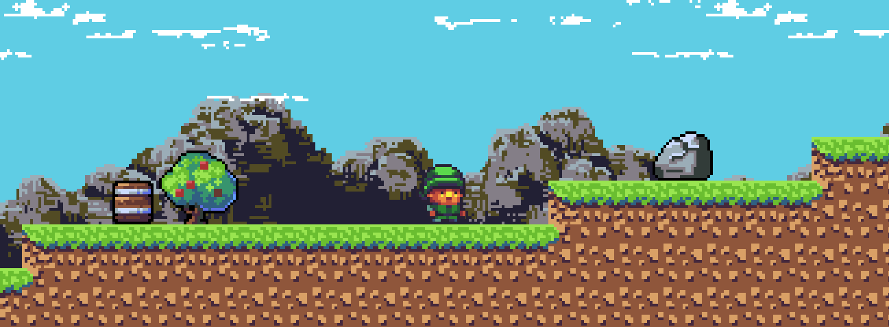
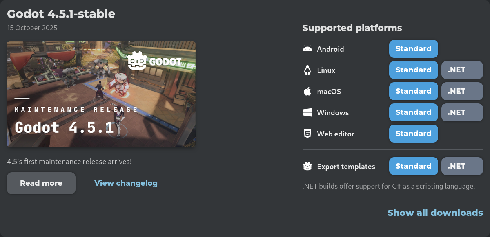

# Online Kurs

Herzlich wilkommen beim Godot onlinekurs. Hier wirst du ein eigenes Spiel bauen. Dabei erlernst du einige Computerfähigkeiten und basiskentnisse vom Spiele-Programmieren.

## Einrichtung

Um Loslegen zu können brauchst du:
1. Elemente für das Spiel
2. Grafikprogramm
3. Gameengine

### Gameengine

Wir nutzen eine Gameengine mit dem Namen **Godot**. Die Gameengine ist wie das Fundament des Spieles. Um Godot 4.5.1 herunterzuladen nutze diesen Link https://godotengine.org/download/archive/4.5.1-stable/ 

Auf dieser Website sind auf der rechten Seite die Platformen ersichtlich. Hier musst du dein **Betriebsystem** finden, und den Blauen Knopf "Standard" dahinter klicken.